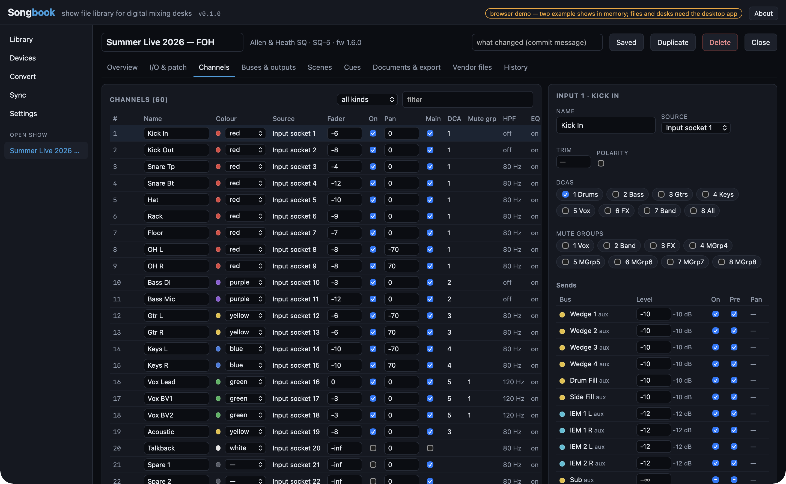
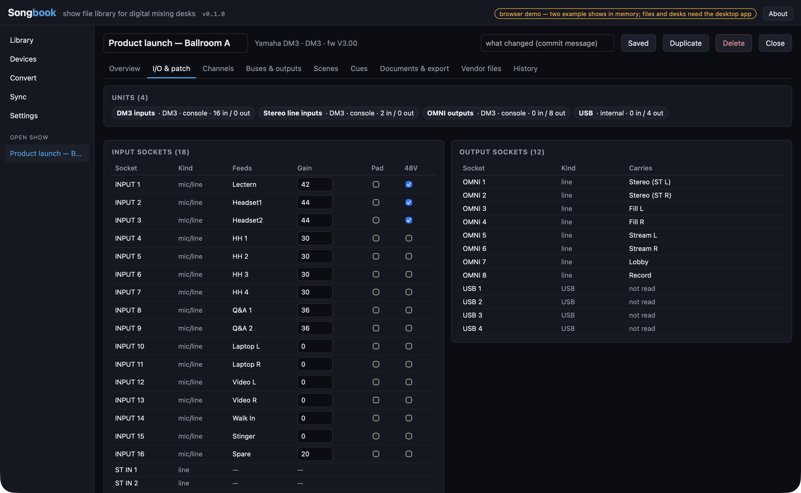
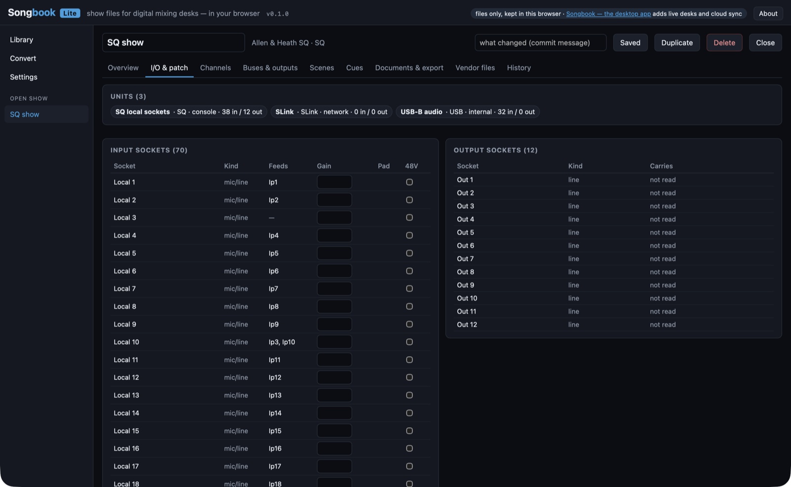

# Songbook

> **AI-assisted project.** This codebase was created with [Claude Code](https://claude.com/claude-code)
> (Anthropic), directed and reviewed by a human author, on 2026-09-19. The file readers were built
> against the vendors' own offline editors (Avantis Director, SQ MixPad, QL Editor, DM3 Editor,
> TF Editor) and the live drivers against the published protocol documents; the Yamaha SCP driver
> follows a DM3 that this fleet drove for real on 2026-09-15, but **no desk has yet been pulled from
> or pushed to by this code**, and the Allen & Heath MIDI/TCP driver has only met an in-process fake.
> See [Status](#status) for exactly what has been exercised and what has not.

A desktop show file library for digital mixing desks. Keep every show for your **Allen & Heath**
(SQ, dLive, Avantis) and **Yamaha** (CL/QL, TF, DM3, DM7, RIVAGE PM) desks, with version history;
inspect the I/O and patch, the channels, the sends, the buses and outputs, the DCAs and mute
groups, the scenes and cues; generate PDF documentation, an input-list CSV, printable label strips
and Companion pages; convert a show between desks with an honest report of what carried, what was
adapted and what was dropped; and pull from or push to the live desk over its own protocol.

Not affiliated with or endorsed by Allen & Heath or Yamaha.





## What it does

| | |
|---|---|
| **Library** | Plain files on disk: `shows/<id>/show.json`, a gzip'd snapshot per saved version, the vendor files. Put the folder in Dropbox / OneDrive / Google Drive and their desktop clients carry it; or let Songbook sync it over the drives' APIs. |
| **Import** | SQ show folders (`NVDATA.DAT` + `SCENEnnn.DAT`, the `AHSQ/Shows/<name>` tree from a USB stick, or a zip of one), dLive / Avantis show archives (`.tar.gz`), Yamaha CL/QL console files (`.CLF`), DM3 / TF / DM7 scenes and presets (`.dm3s`, `.tfs`, `.dm7s`, …), Songbook's own `.json`. |
| **Devices** | Pull the whole mix from a Yamaha desk over SCP (names, colours, faders, mutes, pans, sends, head amps, DCA and mute-group membership, the scene list) or from an A&H desk over MIDI/TCP (SQ: mutes, levels, pans, assignments; dLive / Avantis: names, colours, mutes, faders, sends, dLive preamps). Push the same back. Recall scenes on any of them; store scenes on a Yamaha. |
| **Inspect** | Units and sockets with what feeds what; every channel with its source, preamp, fader, pan, assignments, processing on/off and sends; buses, DCAs, mute groups and the output patch; scenes with notes; a cue list. |
| **Edit** | Names, colours, patch, faders, mutes, pans, sends, DCA and mute-group membership, preamps, scenes, cues. Every save is a version; every version diffs against the last and can be restored. |
| **Document** | A PDF (A4 or Letter) or a self-contained web page, in five themes: cover with the production details, the desk and its sockets as a map, the signal flow, the input list, every fader as a bar chart, a processing matrix, the send matrix as a heat grid, buses and outputs, DCA and mute-group membership, scenes and cues, a glossary of what the settings mean, the import notes, the version history. An input-list CSV. Label strips as 300 dpi PNGs at the fader pitch you give it. |
| **Convert** | Any desk to any other: the show is re-keyed into the target's capacity and spelling — names cut to its length, colours mapped to its palette, buses beyond its count dropped with every send into them — and every adaptation and drop is a note the converted show carries. |
| **Companion** | A Bitfocus Companion page — a mute button per channel, DCA and mute group, a recall per scene — for the `allenheath-sq`, `allenheath-dlive`, `allenheath-avantis` or `yamaha-rcp` module; and reading a page back to check which buttons still match the show. |

## Songbook Lite — the browser version

**<https://songbook-lite.stoatworks-labs.com>** is the same application built as a website:
import show files, inspect and edit them, generate the documentation (PDF or web page) /
CSV / label strips / Companion pages, convert between desks and write SQ shows and `.CLF` files back — with the Rust core
compiled to WebAssembly and the library kept in the browser's IndexedDB. **A show file never
leaves your machine**; there is no server to send it to. What Lite leaves out is exactly what a
web page cannot do: talking to a live desk (raw TCP on 51325 / 49280) and cloud sync. It links to
this repository for the full desktop app.

Build it locally with `npm run build:lite` (needs `rustup target add wasm32-unknown-unknown`);
`npm run dev:lite` serves it on :5179 once `lite/public/songbook.wasm` exists.



## Running the desktop app

```bash
npm install
npm run app          # tauri dev
npm run app:build    # release bundle for this platform
```

Open a browser tab at the Vite dev server instead and you get a demo with two example shows in
memory — every screen works, but files and desks need the desktop app (or Songbook Lite).

## Status

What has been checked, and against what:

- **Allen & Heath show archives (dLive / Avantis)** — read from the factory shows inside
  Avantis Director V2.01 and two shows it stored: the input patch (`Channel Mapper`, confirmed by
  controlled diff), every `Name Colour Manager` block (channel, bus and DCA names and colours),
  the numbered scenes' names and descriptions. The name-block layout was worked out from those
  files and has **not** been checked with a rename-and-diff. Faders, sends, preamps and processing
  are in the scene blobs and not decoded. dLive shows are expected to be the same format; none has
  been examined.
- **SQ show files** — `NVDATA.DAT` gives the input patch for Ip1–48 (located by controlled diff
  in SQ MixPad 1.6.0 as an SQ-7): each record holds a socket index and a class byte — Local and
  USB seen in MixPad's default show, SLink and I/O Port assumed from its tab order — and Local
  49–54 are labelled as the stereo TRS pairs because that is where the default show patches
  Ip41–46. `SCENEnnn.DAT` (scene nnn + 1; the index is 0-based) gives the 16-character scene
  name and stores the patch the scene was saved with. Names, preamps and the mix are not decoded
  from the files; the live driver reads the mix instead. The images' checksum (zlib CRC-32 over
  the body after the 20-byte header) was solved on 2026-09-20; MixPad loaded a Songbook-written
  show, showed its patch and scene name, and on logout re-saved `NVDATA.DAT` **byte-identical**
  to what Songbook had written.
- **Yamaha DM3 / TF scenes** — the MBDF container and the self-describing MMSXLIT payload decode
  all 28 factory scenes shipped inside DM3 Editor V3 and TF Editor V4.50 (names, colours, icons,
  faders, mutes, pans, sends, DCA / mute-group membership, EQ / gate / comp on-off, head amps,
  the input and output patch). The patch-word type codes are the ones seen in those files, never
  checked against a console's patch screen; the TF's one-byte patch field resolves no connector
  and says so. DM7 scenes are the same container; none has been seen.
- **Yamaha CL/QL console files** — the input patch table and the split channel-name table,
  located by controlled diffs in QL Editor V5.8.1 on a QL5; read back from those exact files.
  The offsets are absolute, so the adapter validates the table before trusting it. Nothing else
  in the file is decoded. The file's checksum (a one's-complement word sum over its `MEMAPI`
  record) was solved on 2026-09-20: the writer reproduces three of QL Editor's own saves
  byte-for-byte, QL Editor loads a Songbook-written file and shows its edits, and it refuses the
  same file with one checksum bit flipped ("Checksum error (-2)") — so the law is the one the
  loader checks.
- **Yamaha SCP (live)** — the protocol grammar, the `prminfo` dictionary, the `NOTIFY` push and
  the scene verbs were observed on a real DM3 (V3.00) in this fleet's Dante-BabelBox work; the
  CL/QL, TF, DM7 and RIVAGE grammars follow the `yamaha-rcp` Companion module. The driver's pull,
  push, recall and store are tested against an in-process fake desk that serves the embedded
  dictionaries. **It has not yet run against a desk from this code.**
- **Allen & Heath MIDI/TCP (live)** — message shapes from the SQ MIDI Protocol Issue 5, the
  dLive MIDI over TCP/IP V2.0 and the Avantis MIDI TCP/IP documents, checked against every worked
  example in them and against in-process fake desks. **No desk has answered it yet.** The Avantis
  fader law is assumed to be the dLive one.
- **Conversion, Companion export, documentation, labels, library, history, folder sync** — unit
  tested; the PDF and the web page were read page by page in every theme, and the screenshots
  above were produced from the browser demo and the desktop app.
- **Cloud sync** — Dropbox, Google Drive and OneDrive providers follow their public API
  references with OAuth PKCE on a loopback redirect; they need an app registration only the
  account holder can make and have not been run against a live account.
- **Companion** — the page export matches the control shape Companion 5.0.5 saves and the action
  ids in the installed modules, but has not yet been imported into a running Companion.

Songbook writes two vendor formats, and only the fields it decodes: an SQ show (input patch and
scene names into copies of its images) and a CL/QL `.CLF` (input patch and channel names). Both
checksums are solved and both vendors' editors load the written files (MixPad round-trips the
NVDATA image byte-for-byte; QL Editor checks the checksum and passes ours); whether a console
accepts a written file has not yet been tried on a desk. dLive / Avantis
archives and DM3 / TF / DM7 scenes are kept byte-for-byte and exported as they came; the live
driver is the write path for everything else.

## Layout

```
src/                     React front end (types.ts mirrors the Rust model); lib/lite.ts is the browser backend
lite/                    Songbook Lite: its index.html, Vite config and static files (the wasm is built into lite/public)
src-tauri/src/lib.rs     the Tauri commands, thin
src-tauri/crates/
  songbook-model         the brand-neutral desk show model, diff, validation
  songbook-ah            Allen & Heath: SQ images (read and write), dLive/Avantis archives, MIDI over TCP/IP
  songbook-yamaha        Yamaha: CL/QL .CLF (read and write), DM3/TF/DM7 MBDF scenes, SCP; dict/ holds the desks' prminfo tables
  songbook-library       the on-disk library, history, sync providers, OAuth
  songbook-convert       capability tables, the conversion, blank shows
  songbook-companion     Companion page export/import
  songbook-wasm          the browser build's one entry point (bytes in, bytes out)
fixtures/                files the vendors' editors wrote, for the byte-exact tests
public/demo/             the two example shows the browser demo serves (src-tauri/examples/demo.rs writes them)
docs/NOTES.md            what was learned building it, including the traps
wrangler.toml            the Cloudflare Worker that serves Songbook Lite (static assets only)
```

<!-- attributions:start -->
This project is built on other people's work — see [ATTRIBUTIONS.md](ATTRIBUTIONS.md).
<!-- attributions:end -->

## Licence

MIT. See [ATTRIBUTIONS.md](ATTRIBUTIONS.md) for what it is built on.
